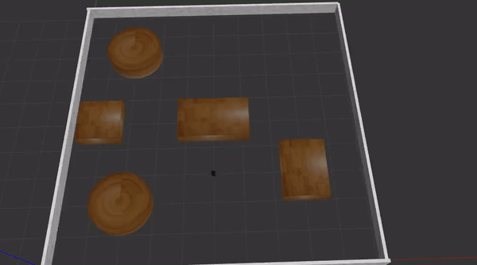

## ENPM 661 Planning for Autonomous Robots
TurtleBot3 planning using A-Star

### Turtle Bot
	For Gazebo:
		Build the turtlebot_ws using catkin build

		Source the workspace

		Launch the file:

		roslaunch astar_turtlebot3 enviroment.launch x_init:=5 y_init:=3 theta_init:=0 x_final:=9 y_final:=9 rpm1:=15 rpm2:=10
		roslaunch astar_turtlebot3 enviroment.launch x_init:=6 y_init:=8 theta_init:=0 x_final:=9 y_final:=9 rpm1:=15 rpm2:=10
		roslaunch astar_turtlebot3 enviroment.launch x_init:=8 y_init:=5 theta_init:=0 x_final:=7 y_final:=7 rpm1:=15 rpm2:=10

### Videos:
	https://drive.google.com/drive/folders/1fi7JmexqAbtwEwpJOb0fXwU10fbkClct?usp=sharing

